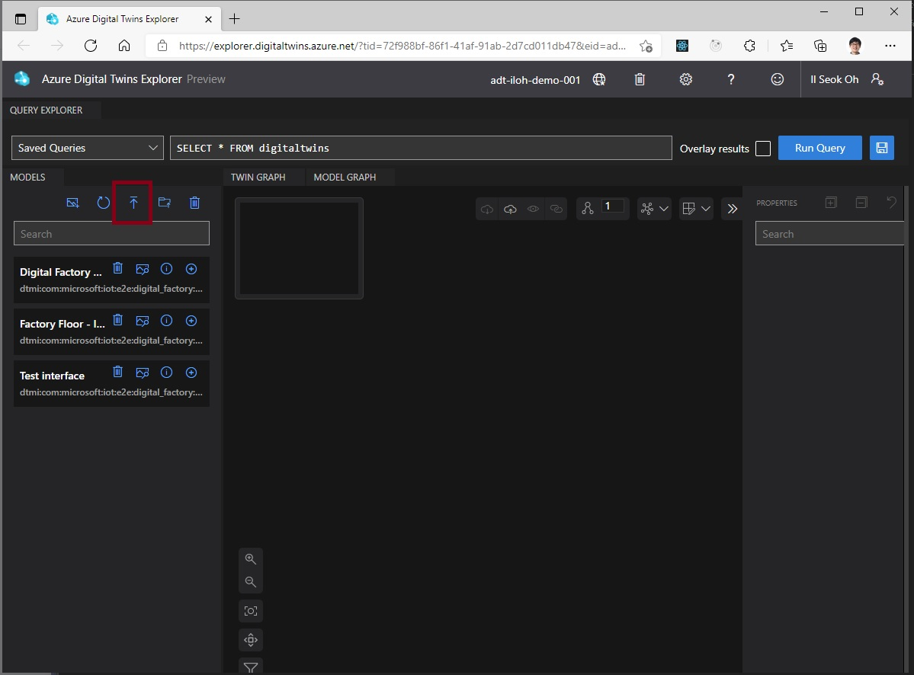

# Excel file to DTDL v2

## 엑셀파일 준비

- [DTDL v2 정의 문서](https://github.com/Azure/opendigitaltwins-dtdl/blob/master/DTDL/v2/dtdlv2.md#references)를 참조했습니다. 
- DTDL v2 스펙에 정의된 모든 내용을 정의하지 않고 꼭 필요한 내용만 구현했습니다. 꼭들어가야 하는 내용이 있으면 알려주세요. 
- 다운로드: [Relase 페이지](https://github.com/ilseokoh/excel2dtdl/releases)에서 Excel2DTDL_Template.xlsx 을 다운로드하여 압축을 풀어줍니다.
- Sample 탭 처럼 Property, Telemetry, Component, Relationship을 입력합니다. 
- 속성 이름 마지막에 ? (물음표)가 붙어 있으면 optional 이고 입력하지 않아도 됩니다. 그 외는 꼭 입력해야 합니다. 
- 특정 타입의 정의가 없다면 모두 지워줍니다. Telemetry, Component가 없다면 모두 지워줍니다. 
- Property, Telemetry, Component, Relationship의 이름(name)은 Unique 해야 합니다. 
- Property, Telemetry의 type과 unit 은 미리 정의된 Semantic Types 을 정의하는데 사용합니다. 문서의 [Semantic Types](https://github.com/Azure/opendigitaltwins-dtdl/blob/master/DTDL/v2/dtdlv2.md#semantic-types)을 참조하세요.

## 사용방법 
- .net core 3.1 이 설치되어야 합니다. [설치 페이지](https://dotnet.microsoft.com/download/dotnet/3.1)
- 다운로드: [Relase 페이지](https://github.com/ilseokoh/excel2dtdl/releases)에서 Excel2DTDL_v1.0.0.zip을 다운로드하여 압축을 풀어줍니다. Visual Studio가 있다면 코드를 받아서 사용해도 됩니다. 
- 터미널을 열어서 압축해제한 폴더로 이동합니다. (> cd cd C:\Users\iloh\source\excel2dtdl\Excel2DTDL\bin\Release\Excel2DTDL_v1.0.0)
- 준비된 엑셀 파일을 파라미터로 입력하여 실행합니다.
- Validation Error가 없다면 dtdl.json을 열어서 확인 합니다. 
```
> cd cd C:\Users\iloh\source\excel2dtdl\Excel2DTDL\bin\Release\Excel2DTDL_v1.0.0

> Excel2DTDL.exe Excel2DTDL_Template.xlsx
Usage: Excel2DTDL <excelfilename.xls>
Validating ...
DTDL is valid.
DTDL is saved to 'dtdl.json' file.
```

## DTDL의 업로드 
- Digital Twin Explorer를 이용하여 업로드 합니다. 
- 모든 Interface 모델이 하나의 파일로 생성됩니다. dtdl.json 파일을 업로드해주세요.

